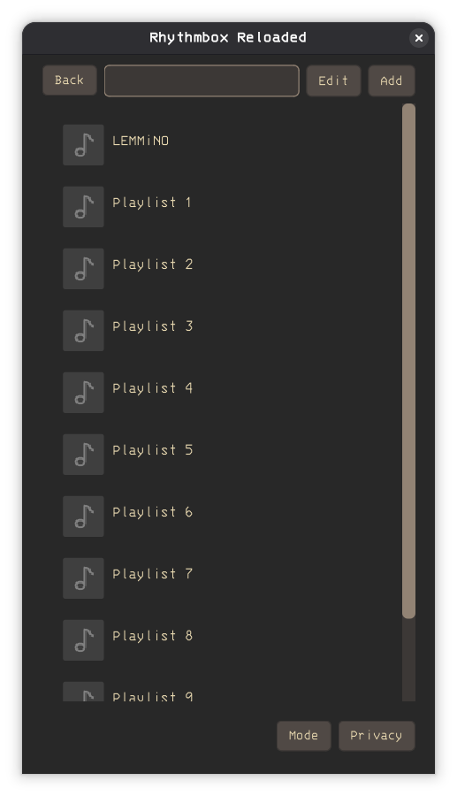
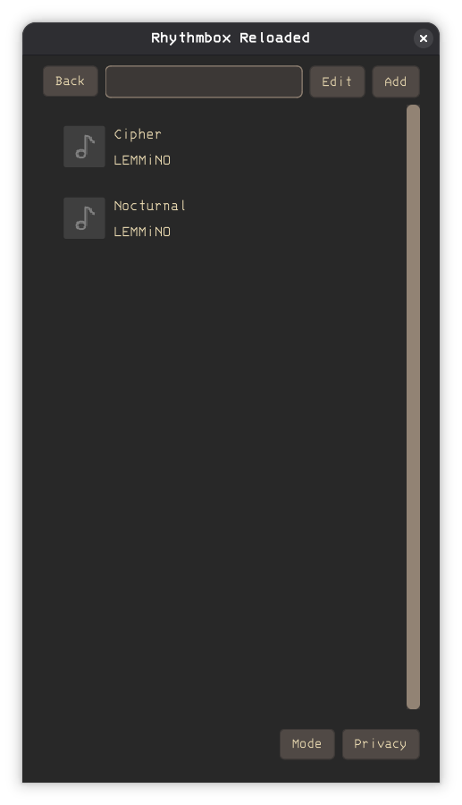
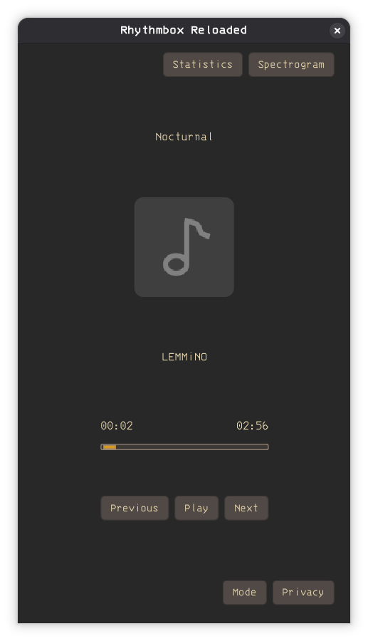
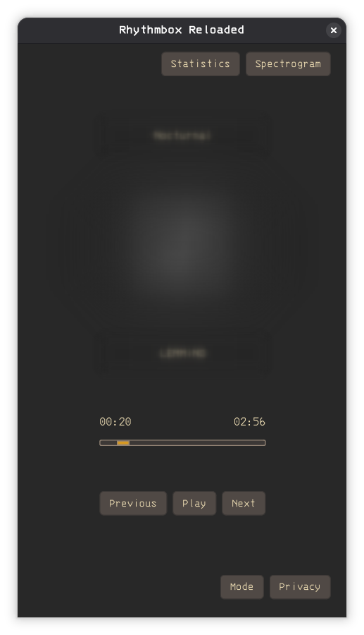
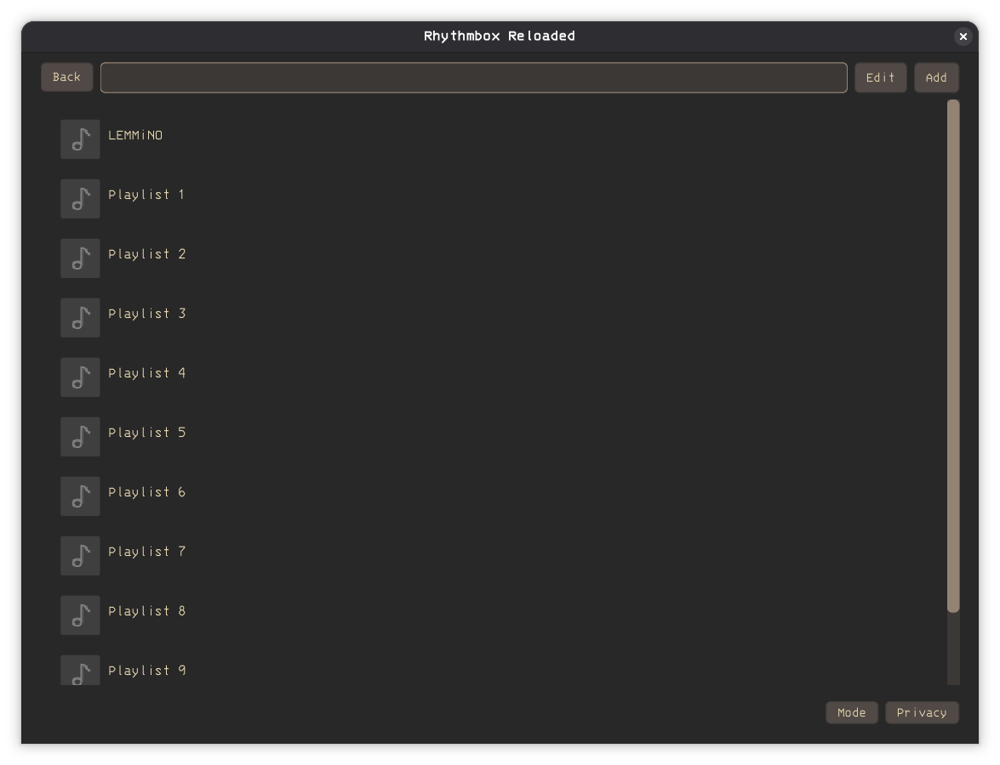
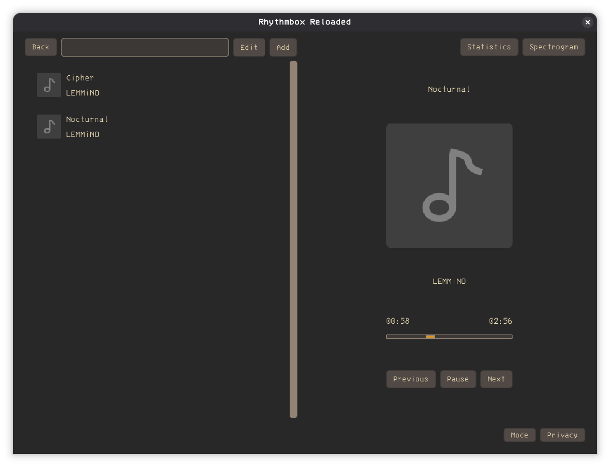
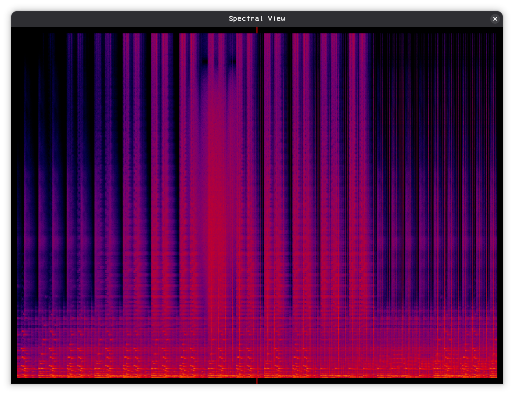

A cross platform offline music player.

Built with two criteria in mind:
- playback completion recording
- clean material-design inspired interface

[](screenshots/minified-playlists-view.png) 
[](screenshots/minified-playlist-view.png) 
[](screenshots/minified-track-view.png)
[](screenshots/minified-track-private-view.png)

[](screenshots/playlists-view.png) 
[](screenshots/playlist-track-view.png)

[](screenshots/spectrogram-view.png)

# Installation

To use this application, simply download and run the executable for your platform from releases.

| Platform | File                       |
|----------|----------------------------|
| Linux    | RhythmboxReloaded.elf      |
| Window   | -                          |
| Mac      | -                          |

The recommended approach for creating executables is building the application on that platform. Building for Windows and Mac requires some extra work that will be completed once the application is stable on Linux. If you would like to use it on those platforms or would like to build the application from source, follow the section on [development](#development).

# Testing

This application is unstable. It has only been tested on Linux and fulfills the minimum feature requirements, but there may be some unexpected behaviour. 

Backup your data frequently - all files in the [application storage](#application-data) are important, with the exception of the `spectrals` directory.

# Development

This application was developed using the [QtCreator IDE](https://doc.qt.io/qtcreator/). It uses the [qmake](https://doc.qt.io/qt-6/qmake-manual.html) build tool to create executables for different platforms.

Clone this repository using `git` or download the source as a ZIP file. Import it into QtCreator by clicking 'File' -> 'Open Existing File or Project' and selecting `RhythmboxReloaded.pro` file. Have a look at the [design](#design) section if you are intrested in modifying the source code.

To build the application, click on the 'Build' icon at the bottom left of the QtCreator IDE. If everything goes well, this should create an executable under the `build/Desktop-Debug` folder.

# Design

## Source Code
The application source code is divided as follows:

```
.
├── application-forms (user interface for main window and reusable elements)
├── application-headers (declarations)
├── application-src (definitions)
├── application-styling (css and svg resources)
├── documentation (using Doxygen)
├── libraries (external libraries)
└── RhythmboxReloaded.pro
```

# Data Storage

## Application Data

The Qt application directory (AppDataLocation) for different plaforms as listed in the [documentation for QStandardPaths](https://doc.qt.io/qt-6/qstandardpaths.html):

| Platform | Location                                                                                   |
|----------|--------------------------------------------------------------------------------------------|
| Linux    | "~/.local/share", "/usr/share", "/usr/local/share"                                         |
| Windows  | "C:/Users/\<USER\>/AppData/Local", "C:/ProgramData", "\<APPDIR\>/data"                     |
| Mac      | "~/Library/Application Support", "/Library/Application Support", "\<APPDIR/../Resources\>" |

\<APPDIR\> is the location your application was installed/extracted to.

## Directory Structure
``` shell
.
├── playlists
│   ├── playlist1.xml
│   └── playlist2.xml
├── playlists.xml
├── recorder
│   ├── playlist1
│   │   ├── track1.xml
│   │   ├── track2.xml
│   └── playlist2
│       └── track6.xml
└── spectrals
    └── playlist1
        ├── track1.png
        └── track2.png
```

The list of all playlists are stored in `playlists.xml`. A playlist is defined by xml files in the `playlist` directory that store the title, artist and file path of audio files.

Audio files are never modified - adding tracks to a playlist simply stores the file path. This can be (and most probably is) in a different external folder. If a file is renamed or moved, the playlist must be updated to reflect the change. This can be done graphically by chosing a new location for an existing track, or manually by editing the corresponding playlist file in `playlists`.

The `recorder` directory records track completions. Each track has a corresponding xml file with a series of timestamps.

The `spectral` directory stores the generated spectrals. Spectrals are generated as required, and may take up a significant amount of storage. It is safe to delete this directory - spectrals will simply be regenerated when required.

# Limitations and Future Development

Play queues are expected to be implemented soon.

[Miniaudio](https://miniaud.io) is used as the audio library and only supports playback of mp3, flac and wav files. Switching to libvlc is planned to support more file formats.

Better metadata handling is required - the current solution is quite restrictive. More research is needed to find and integrate a robust metadata library for the supported file formats.

Album art support was initially implemented but severely degraded performance. A most optimised approach is required.

There is no graphical means of rearranging the order of tracks in a playlist. The xml file needs to be editted manually - see the section on [data storage](#data-storage) for the location of the file.

Visualizations for viewing playback records are planned, but this may be implemented as a seperate tool if it does not integrate well with this application.

